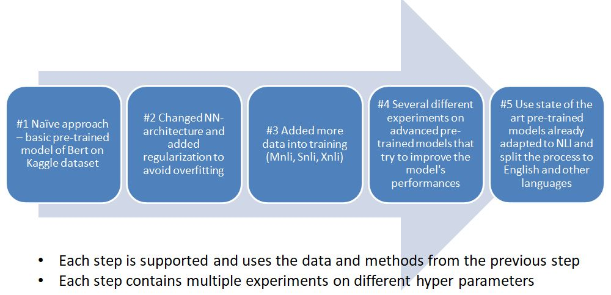

# NLP model for classifying NLI sentences on Kaggle's competition

Natural language inference is the task of determining whether a “hypothesis” is true (entailment), false (contradiction), or undetermined (neutral) given a “premise”. In this project we tried to develop a model which uses pre-trained neural models (BERT based) that aims to achieve the best results as possible on a given dataset from Kaggle competition. In order to achieve it, we explored different Bert models, added more data (Mnli, Snli, Xnli), exmined training techniques and tried different fine-tuning NN-architectures. Our best model achieves 94.28\% accuracy (top 7\% in the competition). 
This project has been used to implement our paper [Natural Language Inference (NLI) Models, Developed By Fine-tuning Transformers](https://github.com/orsho/NLI-kaggle-competition-/blob/main/NLP_Project_on_NLI_using_BERT%20.pdf). Please cite this paper when you use this project.

## Highlighted Features

* Final Model based on 'joeddav/xlm-roberta-large-xnli' and 'microsoft/deberta-v2-xlarge-mnli'
* Implemented using *PyTorch* (1.9.0)
* All code is arranged in one [Colab notebook](https://colab.research.google.com/drive/1FSv1KRXfgW-Gz7Wo_n9xbOK39R35aO2p?usp=sharing)
* The notebook is divided into sections for better understanding the experiments and the models
* The notebook will work in any python IDE environment but it is best to open it in Colab

## Brief summary of the process and experiments

summarization of the process we performed and the key changes we made between each step until we found the model that brings the best results

## Performance of Trained Models
----
**joeddav/xlm-roberta-large-xnli**

Accuracy: 0.9767.
|  | Entail | Neutral | Contradiction |
|-------|-----------|--------|----|
| Precision | 0.9926 | 0.9563 | 0.9814 |
| Recall | 0.9776 | 0.9836 | 0.9691 |
| F1 | 0.9850 | 0.9698 | 0.9752 |

----
**microsoft/deberta-v2-xlarge-mnli**

Accuracy: 0.9191
|  | Entail | Neutral | Contradiction |
|-------|-----------|--------|----|
| Precision | 0.9438 | 0.8936 | 0.9184 |
| Recall | 0.9510 | 0.8750 | 0.9294 |
| F1 | 0.9474 | 0.8842 | 0.9239 |
